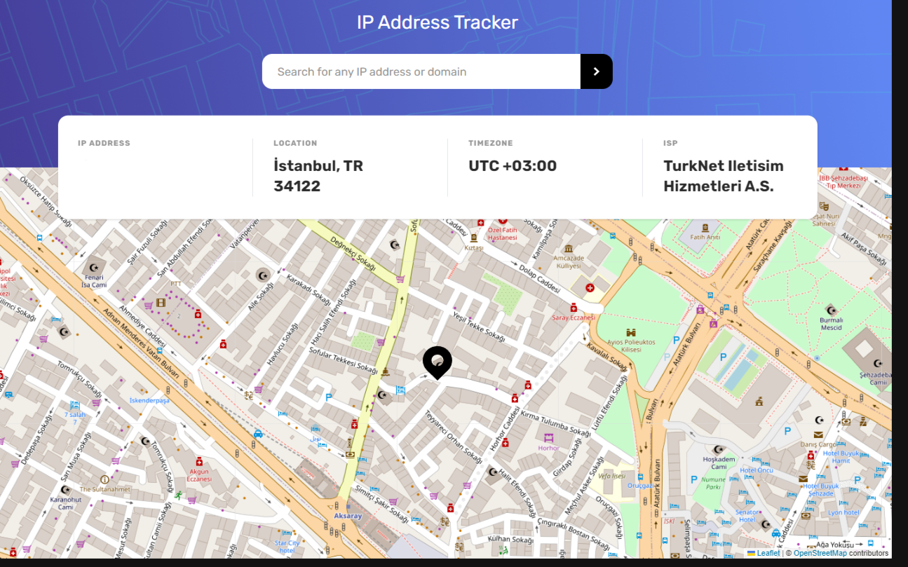

# Frontend Mentor - IP address tracker solution

**_NOTE:_** If the result is not visible on the screen, disable ad blocker and try again.

This is a solution to the [IP address tracker challenge on Frontend Mentor](https://www.frontendmentor.io/challenges/ip-address-tracker-I8-0yYAH0). Frontend Mentor challenges help you improve your coding skills by building realistic projects.

## Installation

```
npm install
```

## Starting project

```
npm run dev
```
### Screenshot



### The challenge

Users should be able to:

- View the optimal layout for each page depending on their device's screen size
- See hover states for all interactive elements on the page
- See their own IP address on the map on the initial page load
- Search for any IP addresses or domains and see the key information and location

### Links

- Solution URL: [https://github.com/utkucanyilmaz/ip-address-tracker]
- Live Site URL: [https://ip-address-tracker-utkucanyilmaz.netlify.app/]

### Built with

- [ReactJS](https://reactjs.org/)
- [Tailwind](https://tailwindcss.com/)
- [IP Geolocation API](https://geo.ipify.org/)
- [Geolocation DB](https://geolocation-db.com/)
- [Leaflet](https://leafletjs.com/)
- [Axios](https://axios-http.com/)

## Links

- Frontend Mentor - [@utkucanyilmaz](https://www.frontendmentor.io/profile/utkucanyilmaz)
- Twitter - [@utkucanyilmaz](https://www.twitter.com/utkucanyilmaz)
- Github - [@utkucanyilmaz](https://github.com/utkucanyilmaz)
